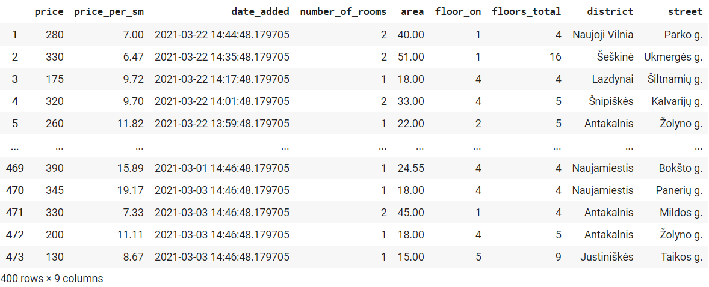

# Scraperuodas |  
**Scraperuodas** has been made as part of the capstone project for module "Data Engineering" on Turing College, a project that encompasses software engineering and reproducable research, SQL and data scraping and deployment of machine learning models. The goal of the project is to set up a complete machine learning pipeline, from creating a Python package for data collection to training a model using the collected data, deploying it on cloud and making the model accessible via basic API. 

Data collection is a part of the process of building a machine learning pipeline. For the purposes of collecting vast amounts of data, automatic data collection tools such as web scrapers and web spiders are employed. **Scraperuodas** is an instance of automatic data collection tools that is specifically designed to extract data from **aruodas.lt**, a popular Lithuanian real estate listings site. 

It scrapes data based on the following categories: number of samples to be collected, city and maximum price. Having collected the data, it is further processed using pandas, a popular data analysis library. As a result, a pandas DataFrame is returned with categories such as *price* (Eur) , *price per square meter* (Eur), *number of rooms*, *area in square meters*, *the floor the apartment listed is on*, *total number of floors on the building*, *date the listing has been added*, *district* and the *street* the apartment is located. 
1. [Introduction](#Introduction)
2. [Installation](#Installation)
3. [Examples](#Examples)
4. [Technologies](#Technologies)
5. [License](#License)
6. [Contact](#Contact)

## Installation
In order to use the package, go through the following two-step process:
1. Install the package directly from GitHub using `pip` by using the following:
```python
pip install git+https://github.com/virbickt/scraperuodas.git
```
2. Once the package is successfully installed, make sure to include the import statement:
```python
from scraperuodas.main import Scraperuodas
```
## Examples
```python
scraper = Scraperuodas()
scraper.scrape_data(400, "vilniuje", 350)
```

## Technologies
- `beautifulsoup4 4.9.3`
- `fake-useragent 0.1.11`
- `pandas 1.2.3`

For the full list of dependencies, please find *requirements.txt*

## Disclaimer
The tool has been created solely for educational purposes and and the data collected has not and cannot be used for any other purposes. The tool has only been put into practice to an extent that meets the educational project requirements. Here we cite the [site's policy](https://www.aruodas.lt/dalyvio-taisykles/) (in Lithuanian) on automatic data collection on the site:
> *3.1.7. nenaudoti jokių automatizuotų priemonių, įskaitant, bet neapsiribojant papildoma kompiuterine technika ir/ar programine įranga, duomenų peržiūrai ir/ar išsaugojimui, Skelbimų sukūrimui, redagavimui, taip pat nenaudoti jokių priemonių, skirtų apdoroti Svetainės turinį ir (ar) dizainą, ir (ar) Paslaugas (įskaitant ir Skelbimų įdėjimą), ar skirtų juos kopijuoti, dekompiliuoti, šifruoti, perprogramuoti, perkelti, nukreipti kitaip nei leidžia standartiniai Svetainės funkcionalumai, nebent su Klientu raštu iš anksto būtų suderinta kitokia Svetainės ir (ar) Paslaugų naudojimo tvarka;*

## License
The project is licenced under [GNU General Public License v3.0](https://github.com/virbickt/calculator/blob/main/LICENSE.md)

## Contact
[tvirbickas@gmail.com](mailto:tvirbickas@gmail.com?subject=Calculator%20on%20Github)
